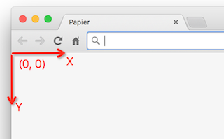
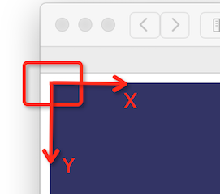
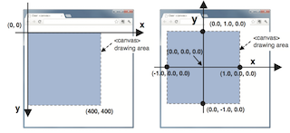

## Draw point with a mouse click

上一个例子中，单独绘制一个给定坐标的点。这个例子所增加的难度在于，这个坐标不再给定，而是需要通过坐标转换来计算。

首先我们获取的，是屏幕坐标；何谓屏幕坐标？即浏览器的可视区域，左上角的点是原点，X 轴指向右侧，Y 轴指向下方。如下图所示：

  

canvas 的坐标与屏幕坐标类似，也是左上角为 (0, 0), 而与屏幕坐标的区别在于，它的原点与屏幕坐标的原点存在着 margin，如下图所示： 



最后是 OpenGL 坐标系统，它的原点位于 canvas 中心位置，与 canvas 的不同如下图所示：

 

综上三个坐标系统的关系，我们可以得到如下转换步骤。

```js
// 屏幕坐标
var x = ev.clientX;
var y = ev.clientY;
// canvas 的 boundingBox
var rect = ev.target.getBoundingClientRect();
// canvas 坐标
var canvasX = x - rect.left;
var canvasY = y - rect.top;
// 继续平移至 canvas 中心
var centerX = canvasX - canvas.width / 2;
var centerY = canvasY - canvas.height / 2;
// 归一化 (normalize)
var glX = centerX / (canvas.width / 2);
var glY = centerY / (canvas.height / 2);
```

最终得到的 (glX, glY) 就是我们针对 OpenGL 坐标系（第三幅图的右侧）的坐标。